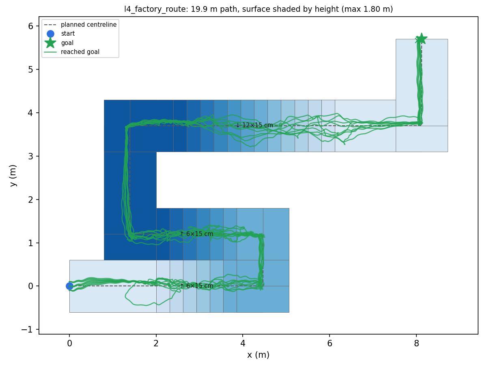

# Factory route course: corners, switchback stairs and descent

A MuJoCo simulation of a Unitree G1 following a planned route through a factory-style layout: ground-floor corridor, a switchback stair up to a 1.8 m mezzanine, two corners, a 12-riser straight flight down and a ground-floor corridor to the goal. The earlier experiments in this repository were a single straight corridor–stair–corridor; this adds turns, 180° landings, several flights in one route and descending stairs.

**Assumption.** The factory has fixed cameras that track the robot and report its position and heading on a known floor plan. In this layer-1 experiment the reported pose is the **MuJoCo ground truth at 50 Hz**, i.e. an ideal camera system. No camera image is rendered or processed, and the locomotion policy itself stays blind. The `Localizer` in [`run_factory_course.py`](../../scripts/run_factory_course.py) already accepts noise, update-rate and latency settings for the next experiment (camera error tolerance).

## Controller

- **Locomotion:** the third-party [G1DWAQ_Lab](https://github.com/liuyufei-nubot/G1DWAQ_Lab) `model_9999.pt` blind stair policy (commit `bebb0ea`, checkpoint SHA-256 in every run JSON) for the whole route. It was not trained in this project. Its training terrain includes stairs up and down (0–23 cm) and yaw-rate commands up to ±1.0 rad/s.
- **Route follower** (ours): tracks each segment centreline with the same lateral/heading feedback as the earlier stair sweep. It uses 0.5 m/s on corridors and 0.3 m/s from 1 m before a flight until 0.5 m after it. It turns only on flat corner landings, never on a flight: stop at the corner point, rotate at a constant 1.0 rad/s, then hand back to walking within 9°.
- **Stall recovery** (optional, `--recovery`): if route progress is under 5 cm in 4 s, walk backwards at 0.2 m/s for 1 s, then retry.

## Courses

All flights: 15 cm rise, 31 cm tread, 1.2 m walkway width (the tested-good geometry from [`../stair-sweep`](../stair-sweep/README.md)). Scenes, route definitions and maps are in [`courses/`](courses/). Every corner and stair start is on a flat landing at least half a walkway wide; the builder refuses layouts that violate this.

| Course | Route | Path | Turns | Risers |
| --- | --- | ---: | ---: | ---: |
| `l1_corner` | corridor, 90° left, corridor | 6.0 m | 1 | 0 |
| `diag_uturn` | ground-floor 180° U-turn (two 90° turns) | 5.2 m | 2 | 0 |
| `l2_corner_stairs` | corner, straight flight up, landing, right corner, mezzanine corridor | 11.1 m | 2 | 10 up |
| `l3_switchback` | flight up, 180° landing, flight up, corner, mezzanine corridor | 11.7 m | 3 | 12 up |
| `l4_factory_route` | switchback up to 1.8 m, two corners, straight flight down, two ground-floor corridors | 19.9 m | 5 | 12 up, 12 down |
| `diag_down` | start on a 1.5 m mezzanine, straight 10-riser flight down | 7.1 m | 0 | 10 down |



## Result

Each cell is **9 deterministic runs**: start offsets −10 / 0 / +10 cm lateral × −5 / 0 / +5° heading. Outcomes: `path exit` means the pelvis left the walkway (|cross-track| > 60 cm, or it left the corner landing). `stuck` means less than 10 cm of route progress in 25 s. No run fell. Full per-run data is in [`runs/matrix.csv`](runs/matrix.csv) and [`runs/results.md`](runs/results.md).

| Course | No stall recovery | With stall recovery | Mean time to goal (with recovery) |
| --- | ---: | ---: | ---: |
| `l1_corner` | 9/9 | 9/9 | 14.9 s |
| `diag_uturn` | 9/9 | 9/9 | 16.6 s |
| `l2_corner_stairs` | 9/9 | 8/9 (1 path exit on the up flight) | 39.6 s |
| `l3_switchback` | 8/9 (1 stuck at first riser) | 9/9 | 51.7 s |
| `l4_factory_route` | 6/9 (2 path exits on the down flight, 1 stuck at first riser) | **9/9** | 80.6 s |
| `diag_down` | 7/9 (2 path exits on the down flight) | 7/9 (same) | 19.1 s |
| **All** | **48/54** | **51/54** | |

Mean absolute cross-track error with recovery was 7–8 cm on the stair courses and 10 cm on `diag_down`. The walkway half-width is 60 cm.

How to read the recovery column: on `l4_factory_route` the back-off fired in 3 of 9 runs (2–3 times each). It directly cleared the first-riser stall. In the two runs that had left the walkway on the descent, it also fired earlier on the route, which changed the robot's timing, and the descent then succeeded. That descent improvement is therefore **not** a demonstrated effect of recovery: `diag_down`, which has no stalls, still fails 2/9 either way. Nine fixed starts per cell are not a success-rate estimate, and a one-run difference is within noise.

## What we learned about the policy (and fixed in the route follower)

These were found while building the course, and each changed the controller:

1. **Right turns in place are ~4× weaker than left turns at moderate commands.** With 0.6 rad/s commanded in place, the measured yaw rate was +0.25 rad/s turning left but only −0.06 rad/s turning right. At 1.0 rad/s it was +0.45 / −0.38 rad/s. Proportional turning stalled a few degrees short of the target, so corners now use a constant 1.0 rad/s. The first working version needed ~120 s for L4; full-rate turning cut that to ~80 s.
2. **Small commands are ignored.** Below roughly 0.4 rad/s yaw or 0.2 m/s forward, the robot steps in place. Corner approaches now never command less than 0.3 m/s.
3. **Faster stair commands are worse.** At 0.4 m/s instead of 0.3 m/s on the flights (measured with the earlier 0.6 rad/s turn controller), L2–L4 dropped to 0–1/9, mostly by walking off the side of the flight.
4. **Two failure modes remain, both properties of the blind policy.** (a) *Riser stall:* the robot steps in place against a riser (the same failure as the `time_limit` runs in the earlier stair sweep); back-off-and-retry clears it. (b) *Descent twist:* on the 3rd–5th step down it sometimes yaws sharply (up to ~80°) and drifts off the flight, even with perfect position feedback. This is the main open problem on the route, and the stair policy never sees the steps. Possible remedies are slower descent commands, railings or narrower flights, or a perception-aware policy.

## Videos

No text is burned into the picture. The camera follows the robot from the rear left, and the green pad is the goal.

- [`l4_factory_route_v30_rec_y+0cm_yaw+0_ideal.mp4`](runs/l4_factory_route_v30_rec_y+0cm_yaw+0_ideal.mp4): full route, success, 75 s
- [`l4_factory_route_v30_y-10cm_yaw-5_ideal.mp4`](runs/l4_factory_route_v30_y-10cm_yaw-5_ideal.mp4): same start without recovery, stuck at the first riser
- [`l4_factory_route_v30_rec_y-10cm_yaw-5_ideal.mp4`](runs/l4_factory_route_v30_rec_y-10cm_yaw-5_ideal.mp4): same start with recovery, success, 88 s
- [`l3_switchback_v30_rec_y+0cm_yaw+0_ideal.mp4`](runs/l3_switchback_v30_rec_y+0cm_yaw+0_ideal.mp4): switchback with 180° landing, success
- [`diag_down_v30_y+0cm_yaw+0_ideal.mp4`](runs/diag_down_v30_y+0cm_yaw+0_ideal.mp4): descent twist and path exit

## Reproduce

Set up G1DWAQ_Lab, MuJoCo, PyTorch and FFmpeg as described in [`../stair-sweep`](../stair-sweep/README.md), plus `matplotlib`. From the repository root:

```bash
python scripts/factory_course.py                      # scenes, maps and route JSON into courses/
python scripts/run_factory_course.py --course l4_factory_route --recovery --video --source-root /path/to/G1DWAQ_Lab/TienKung-Lab
python scripts/summarize_factory_course.py            # matrix.csv, results.md, overview maps
```

Each run takes 1–7 s of CPU time without video. The 108-run matrix ran as a Slurm job on the Chalmers Minerva cluster; videos were rendered on a GPU node with `MUJOCO_GL=egl`. The runner stubs out `pynput` because it needs an X display and is only used for keyboard control. Every run JSON records the checkpoint hash and the hashes of both course scripts.

## Limits

Simulation only (sim-to-sim: Isaac Lab-trained policy, MuJoCo evaluation). Localization is perfect. Friction, geometry and actuator properties are not randomized. Every course uses one stair geometry. Real deployment would additionally need camera error tolerance (next experiment), railings, fall protection and hardware validation.
