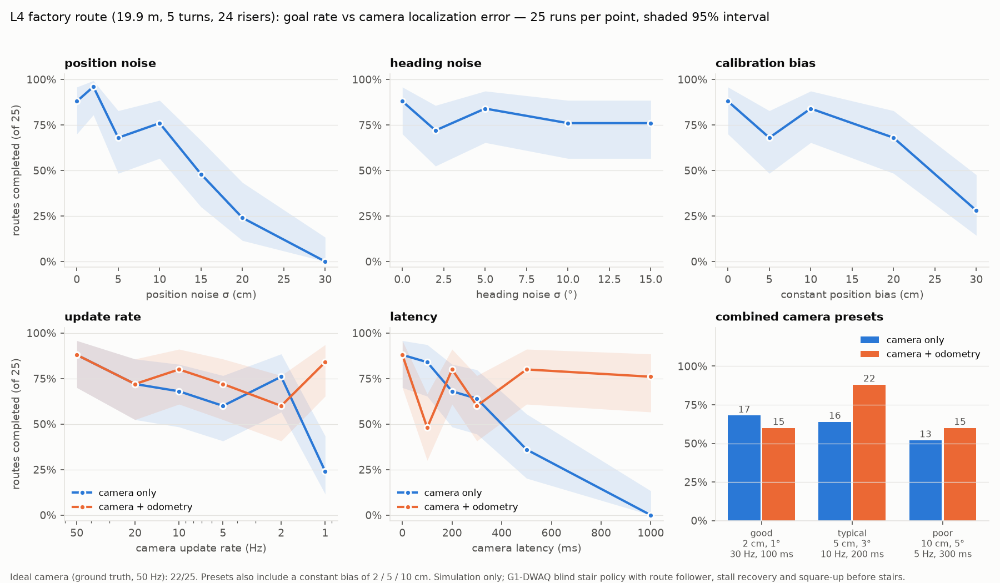

# How good must the factory cameras be? Localization error sweep

The [factory route course](../README.md) assumes fixed factory cameras tell the G1 where it is. There, the reported pose was perfect: MuJoCo ground truth at 50 Hz. This experiment makes the reported pose worse in controlled ways and measures when the robot stops completing the route. The result is a **specification for the camera tracking system** rather than a single success figure.



## Setup

- **Route:** `l4_factory_route`, the full 19.9 m route: switchback up to a 1.8 m mezzanine, 5 turns, 12 risers up and 12 down. The controller is the G1-DWAQ blind stair policy with the route follower, stall recovery and square-up before stairs (`--recovery --align`).
- **25 runs per condition:** a 5 × 5 grid of start offsets (lateral −10/−5/0/5/10 cm × heading −5/−2.5/0/2.5/5°). Each run has its own noise seed and is deterministic given that seed. The shaded bands and "95% interval" column are Wilson score intervals. With 25 runs, differences under about 20 percentage points are not distinguishable.
- **Camera model** (`Localizer` in [`run_factory_course.py`](../../../scripts/run_factory_course.py)). Each camera fix is the true pose from *latency* ago, plus independent Gaussian noise on x, y and heading, plus a constant calibration bias. The bias has a fixed size and a random direction per run. Fixes arrive at the *update rate*. The robot holds the last fix until the next one arrives.
- **Camera + odometry fusion** (`--loc-fusion`). Between fixes, the robot integrates its own motion on top of the last fix, including the time the fix spent in transit. Its motion estimate is planar velocity with a ±10% scale error plus gyro yaw rate with a 0.01 rad/s bias. This is simulated odometry derived from the true velocity, so it is kinder than real leg odometry, which also slips.
- **Scoring:** the robot stops when it *believes* it has arrived. It counts as a goal only if the true pelvis position is within 30 cm of the goal point; otherwise the outcome is `wrong stop`. Other outcomes are as in the route course (`path exit`, `fall`, `stuck`).
- The camera image is never rendered: this tests the *consequence* of a given localization accuracy, not a particular vision algorithm.

## Result

With a perfect camera, the route succeeds in **22/25 (88%, interval 70–96%)**. All three failures are path exits on the descending flight, which is a limitation of the policy, not of localization. Full numbers are in [`results.md`](results.md) and [`sweep.csv`](sweep.csv), and one JSON per run is in this folder.

| Camera property (one varied at a time) | Still comparable to the perfect camera | Clearly worse |
| --- | --- | --- |
| Position noise σ | ≤ 10 cm (68–96%) | 15 cm: 48% · 20 cm: 24% · 30 cm: 0% |
| Heading noise σ | up to 15° (72–84%), no detectable effect | — |
| Constant position bias | ≤ 20 cm (68–84%) | 30 cm: 28% |
| Update rate, camera only | ≥ 2 Hz (60–76%) | 1 Hz: 24% |
| Update rate, camera + odometry | down to 1 Hz (60–84%) | — |
| Latency, camera only | ≤ 300 ms (64–84%) | 500 ms: 36% · 1 s: 0% |
| Latency, camera + odometry | up to 1 s (76–80% at 500 ms–1 s) | — |

Combined presets, each also with a constant bias of 2 / 5 / 10 cm:

| Preset | Noise | Rate | Latency | Camera only | Camera + odometry |
| --- | --- | ---: | ---: | ---: | ---: |
| good | 2 cm, 1° | 30 Hz | 100 ms | 17/25 | 15/25 |
| typical | 5 cm, 3° | 10 Hz | 200 ms | 16/25 | 22/25 |
| poor | 10 cm, 5° | 5 Hz | 300 ms | 13/25 | 15/25 |

The presets are not distinguishable from each other or from the single-factor points in the "comparable" column. All of them lie between 52% and 88%.

## What this means

1. **An ordinary camera tracking system is enough; the bottleneck is the policy.** Within about 10 cm noise, 20 cm bias, 2 Hz and 300 ms, the route's success rate is statistically indistinguishable from a perfect camera. Almost every remaining failure is the blind policy leaving the descending flight. Improving the camera further will not fix that; improving stair descent will. That is where training effort should go.
2. **The failure mechanisms change past the limits.** With large noise or bias, the robot drifts off the flight edge (`path exit`), falls, or stops in the wrong place. With slow or late fixes, it walks for up to a second on a stale position, overshoots corners and stops short or long (`wrong stop` is 24 of the 60 failures at 1 Hz, 500 ms and 1 s, camera only).
3. **Fusing the robot's own odometry relaxes the timing requirements.** Rate falls from 2 Hz to 1 Hz, and latency rises from 300 ms to 1 s. Noise and bias limits are unchanged, because odometry cannot remove a camera's systematic error. This is a hybrid design: the camera provides absolute position, and odometry bridges the gaps.
4. **Heading from the camera barely matters** within ±15° of white noise. The policy's response to heading commands is slow compared with the 50 Hz noise, so the noise averages out.

**Suggested specification for this route:** position σ ≤ 10 cm, systematic offset ≤ 20 cm, ≥ 2 Hz and ≤ 300 ms, or ≥ 1 Hz and ≤ 1 s latency with on-board odometry fusion. These are the largest *tested* values that were not clearly worse, not measured thresholds. A deployment spec should keep a margin below them.

## Caveats

- Tested in one simulated route with one policy and one stair geometry.
- Noise is independent frame to frame. Real camera errors are correlated in time and depend on position (occlusion, lens distortion, distance to the camera); correlated errors behave more like bias.
- Odometry is simulated from true velocity. Real leg odometry drifts more, especially on stairs.
- Two cells are not explained by the model. Camera + odometry at 100 ms latency scored 12/25, below both 0 ms and 200 ms (20/25). Camera-only 5 cm noise (17/25) scored lower than 10 cm (19/25). With 25 chaotic runs per cell this is within what chance can produce, but it is noted rather than smoothed over.

## Reproduce

From the repository root, with the setup described in the [route course README](../README.md):

```bash
python scripts/run_factory_course.py --course l4_factory_route --recovery --align \
  --loc-sigma-cm 5 --loc-yaw-sigma-deg 3 --loc-rate-hz 10 --loc-latency-ms 200 --loc-bias-cm 5 --loc-fusion \
  --start-y-cm 0 --start-yaw-deg 0 --seed 13 --output-dir artifacts/factory-course/localization-sweep \
  --source-root /path/to/G1DWAQ_Lab/TienKung-Lab
python scripts/summarize_localization.py
```

The sweep used seeds 1–25 in grid order: lateral offset outer loop −10 → 10 cm, heading inner loop −5 → 5°. It ran as 1025 runs in one Slurm job (24 cores, a few minutes) on the Chalmers Minerva cluster. The per-run trajectories (82 MB) are not committed; rerunning a condition with the same seed reproduces them exactly.
