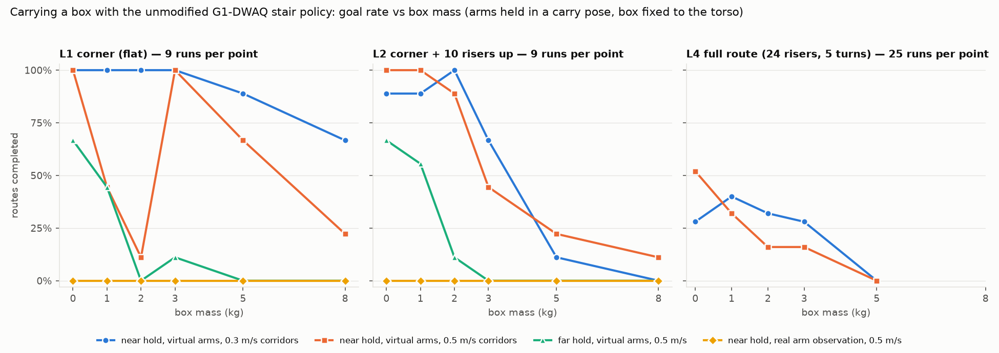

# Carrying a box with the existing stair policy (no retraining)

Can the pretrained G1-DWAQ stair policy used in the [factory route course](../README.md) walk the same routes while holding a box? This is a **zero-shot** test: the policy is unchanged. Only our controller around it changes.



## What was simulated

- **Carry pose.** Both arms are taken away from the policy and held by PD control in a fixed pose, reached over the first 0.5 s. Shoulder pitch −0.5, roll ∓0.05, elbow 0.9 (*far* hold) or 1.5 (*near* hold). The legs and waist stay under the policy.
- **Box.** A 20 cm cube between the hands, rigidly fixed to the torso link, with no collisions. Its centre is 0.26 m (far) or 0.19 m (near) ahead of the pelvis. Masses are 0, 1, 2, 3, 5 and 8 kg; the robot itself weighs 33.3 kg. Because the box is fixed to the torso, **arm torque limits are not modelled**. G1 arms are rated for about 2 kg (standard) or 3 kg (EDU), less at full reach, so results above 3 kg only say the *balance* held, not that real arms could lift the box.
- **Arm observation.** With `real`, the policy observes its locked arms. With `virtual`, it observes a simulated free arm that follows its own arm commands with a 50 ms lag, while the physical arms stay locked. Physics is identical in both cases.
- **Controller.** Route follower with stall recovery and square-up before stairs, ideal localization, 0.3 m/s on stairs. Corridor speed is 0.5 m/s (default) or 0.3 m/s. L1 and L2 use 9 starts (±10 cm × ±5°); L4 uses the 25-start grid.

How the training relates: the policy was trained with ±5 kg of random mass **added at the torso centre** and random pushes. A box held in front also moves the centre of mass forward (a 5 kg box at 0.19 m moves it about 2.5 cm). Centre-of-mass randomization is commented out in its training config, and it never trained with locked arms.

## Results

Full table with 95% intervals: [`results.md`](results.md) / [`summary.csv`](summary.csv).

| Course | Arms free, no box (reference) | Box, best zero-shot setup: near hold, virtual arms | |
| --- | --- | --- | --- |
| | | 0.3 m/s corridors | 0.5 m/s corridors |
| L1 corner (flat), 9 runs | 9/9 | 0–3 kg: 9/9 · 5 kg: 8/9 · 8 kg: 6/9 | 0 kg: 9/9 · 1 kg: 4/9 · 2 kg: 1/9 · 3 kg: 9/9 · 5 kg: 6/9 · 8 kg: 2/9 |
| L2 corner + stairs up, 9 runs | 7/9 | 0–1 kg: 8/9 · 2 kg: 9/9 · 3 kg: 6/9 · 5 kg: 1/9 · 8 kg: 0/9 | 0–1 kg: 9/9 · 2 kg: 8/9 · 3 kg: 4/9 · 5 kg: 2/9 · 8 kg: 1/9 |
| L4 full route, 25 runs | 22/25 at 0.5 m/s, 14/25 at 0.3 m/s | 0 kg: 7 · 1 kg: 10 · 2 kg: 8 · 3 kg: 7 · 5 kg: 0 (of 25) | 0 kg: 13 · 1 kg: 8 · 2 kg: 4 · 3 kg: 4 · 5 kg: 0 (of 25) |

1. **Holding the arms still breaks the policy unless it is shown virtual arms.** With the real (locked) arm state in its observation, it stalls or drifts, even with a 0 kg box. The near hold had 0 of 108 successes. The far hold had 11 of 108, all on flat L1 with 2–5 kg and none with 0 kg. It yaws steadily and walks at 0.05–0.1 m/s. Showing it a virtual free-arm state restores walking, and 0 kg carries become as reliable as free arms on L1 and L2. This is a cheap way to decouple a locomotion policy from the upper body, and it works without retraining.
2. **Hold the box close.** The far hold (0.26 m) fails from 2 kg on L1 and L2. The near hold (0.19 m) carries 2 kg up the L2 stairs in 8–9 of 9 runs.
3. **Walk slower with a load on flat ground.** At 0.3 m/s the near hold carries up to 3 kg around the L1 corner 9/9, and 8 kg 6/9. At 0.5 m/s the load drives the robot past the corner point: it cannot stop, keeps moving forward while commanded backwards, and leaves the landing while turning. Loaded runs finish faster than unloaded ones even at the same command (L4 goal times 49–65 s vs 81 s), because the forward centre of mass keeps pulling the robot ahead.
4. **The full route is where zero-shot carrying stops being usable.** On L4, success is 16–52% for 0–3 kg (depending on mass and corridor speed) and 0/25 at 5 kg. Most failures are on the 12-riser descent, the same weak spot as without a box, now made worse. At 5 kg, corners fail too (turning in place on landings with the load).

**Bottom line:** without retraining, and with a close hold, virtual arm observation and slow corridors, the existing policy carries **about 2 kg** reliably on a single flight (L2), which matches the G1's rated arm payload. It does **not** carry any load reliably over the full route with a descent. Reliable load carrying on stairs needs a policy trained for it: payload mass and centre-of-mass randomization, a fixed or separately controlled upper body, and more descent practice. That is the fine-tuning step of the pipeline.

## Videos

In [`videos/`](videos/), each rendered from the centred start (same outcome as in the sweep). The box is brown, between the hands.

| Video | Setup | Outcome |
| --- | --- | --- |
| [L2, 2 kg](videos/l2_corner_stairs_v30_rec_carry2kgnear_varm_align_y+0cm_yaw+0_ideal_flat30.mp4) | near, virtual arms, 0.3 m/s | goal, 33 s |
| [L1, 8 kg](videos/l1_corner_v30_rec_carry8kgnear_varm_align_y+0cm_yaw+0_ideal_flat30.mp4) | near, virtual arms, 0.3 m/s | goal, 11 s (load pulls it faster than commanded) |
| [L2, 0 kg, real arm observation](videos/l2_corner_stairs_v30_rec_carry0kgnear_align_y+0cm_yaw+0_ideal.mp4) | near, real arms | stuck on flat ground, drifting |
| [L2, 5 kg](videos/l2_corner_stairs_v30_rec_carry5kgnear_varm_align_y+0cm_yaw+0_ideal_flat30.mp4) | near, virtual arms, 0.3 m/s | climbs, then leaves the top landing while turning |
| [L4, 2 kg](videos/l4_factory_route_v30_rec_carry2kgnear_varm_align_y+0cm_yaw+0_ideal_flat30.mp4) | near, virtual arms, 0.3 m/s | full route, goal, 53 s |
| [L4, 3 kg](videos/l4_factory_route_v30_rec_carry3kgnear_varm_align_y+0cm_yaw+0_ideal_flat30.mp4) | near, virtual arms, 0.3 m/s | leaves the descending flight |

## Reproduce

```bash
python scripts/run_factory_course.py --course l2_corner_stairs --recovery --align --payload-kg 2 \
  --carry-reach near --arm-obs virtual --flat-speed 0.3 --tag _flat30 \
  --output-dir artifacts/factory-course/payload-sweep --source-root /path/to/G1DWAQ_Lab/TienKung-Lab
python scripts/summarize_payload.py
```

Per-run JSONs are committed; trajectories (51 MB) are not, and rerunning reproduces them exactly.
